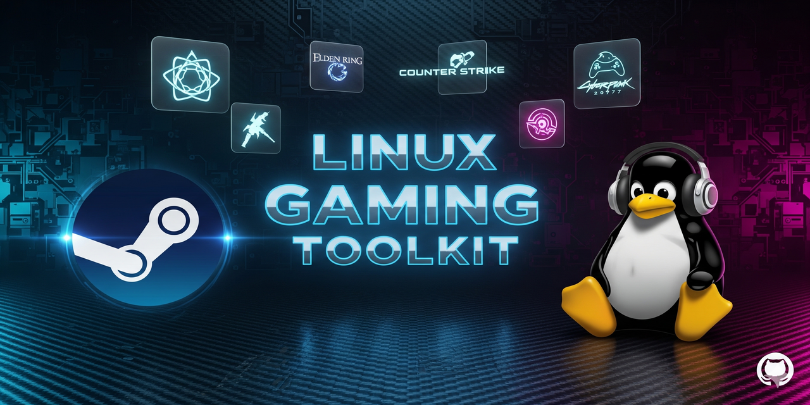

# 🎮 Linux Gaming Toolkit


> Transform any Linux distribution into a gaming powerhouse

[](https://github.com/mohandshamada/Linux_Gaming_toolkit)
[](LICENSE)

A comprehensive, modular bash script that automates gaming setup across Debian, Ubuntu, Fedora, Arch Linux, and openSUSE.

---

## ✨ What's New in Version 3

| Feature | Description |
|---------|-------------|
| 💾 **ZRAM** | Automated compressed RAM swap for systems with ≤16GB RAM |
| 🔋 **Power Profiles** | Intelligent `power-profiles-daemon` configuration |
| 🚀 **NTSync** | Kernel 6.14+ native NT synchronization for Wine |
| ⚡ **Sched-ext** | BPF-based CPU scheduler support (kernel 6.12+) |
| 🎮 **Handheld Mode** | Auto-detection for Steam Deck, ROG Ally, Legion Go |
| 🛠️ **Modular Design** | Separated utilities and detection modules |
| 📦 **2026 Stack** | `input-remapper`, `obs-vkcapture`, `scx-utils` |

---

## 🚀 Quick Start

```bash
git clone https://github.com/mohandshamada/Linux_Gaming_toolkit.git
cd Linux_Gaming_toolkit
chmod +x gamingtoolkit.sh
sudo ./gamingtoolkit.sh
```

---

## 📋 Menu Options

| Option | Action |
|--------|--------|
| 1 | 🚀 **Full Setup** - Install everything automatically |
| 2 | 📦 Gaming Packages Only |
| 3 | 🐧 Gaming Kernel |
| 4 | 🎨 GPU Drivers |
| 5 | ⚙️ System Optimizations |
| 6 | 💾 ZRAM Setup |
| 7 | 🔋 Power Profiles |
| 8 | 🔥 CPU Governor |
| 9 | ⚠️ Disable CPU Mitigations |
| 10 | 📊 Configure MangoHud |
| 11 | 🎲 Configure GameMode |
| 12 | 🛠️ Additional Tools |
| 13 | 🌐 Check Latest Drivers |
| 14 | 🎮 Handheld/Deck Tools |
| 0 | 🚪 Exit |

---

## 🎮 What Gets Installed

### Gaming Platforms
- Steam (with Proton)
- Lutris
- Heroic Games Launcher
- Bottles
- itch.io
- Prism Launcher (Minecraft)
- SOBER (Roblox)
- Waydroid (Android)

### Performance Tools
- GameMode
- MangoHud
- Gamescope
- vkBasalt
- obs-vkcapture

### System Optimizations
- **ZRAM** - Compressed swap
- **Power Profiles** - Desktop/Handheld auto-detection
- **NTSync** - Wine synchronization (kernel 6.14+)
- **Sched-ext** - BPF schedulers (kernel 6.12+)
- **vm.max_map_count** - 2.1M+ for AAA games
- **MGLRU** - Multi-Gen LRU
- **BBR** - TCP congestion control

### GPU Drivers
- **NVIDIA**: Proprietary or Open Kernel Modules (555+)
- **AMD**: Mesa RADV
- **Intel**: Mesa with Arc/DG2 support

---

## 🖥️ Supported Distributions

| Distro | Support |
|--------|---------|
| Ubuntu / Linux Mint / Pop!_OS | ⭐⭐⭐ Full |
| Debian | ⭐⭐⭐ Full |
| Fedora / Nobara | ⭐⭐⭐ Full |
| Arch / Manjaro / CachyOS | ⭐⭐⭐ Full |
| openSUSE Tumbleweed | ⭐⭐ Good |

---

## 🛡️ Safety Features

- **Idempotent** - Safe to run multiple times
- **Backup System** - All configs backed up before changes
- **Error Trapping** - `set -Eeuo pipefail` with line numbers
- **Modular Design** - Easy to debug and extend

---

## 🗑️ Uninstallation

```bash
sudo ./uninstall.sh
```

---

## 📊 Performance Impact

| Optimization | FPS Gain | Frame Stability |
|-------------|----------|-----------------|
| NTSync (6.14+) | 15-40% | ⭐⭐⭐ Huge |
| Sched-ext | 5-10% | ⭐⭐ Better |
| Disabled Mitigations | 5-20% | ⭐ Significant |
| GameMode + ZRAM | 2-5% | ⭐ Noticeable |

---

## 📁 Project Structure

```
Linux_Gaming_toolkit/
├── gamingtoolkit.sh      # Main script
├── uninstall.sh          # Uninstall/restore
├── README.md            # This file
├── modules/
│   ├── utils.sh         # Utility functions
│   └── detection.sh     # System detection
└── test/                # Test suite
    ├── Dockerfile.*     # Docker test environments
    └── *.sh             # Test scripts
```

---

## 🤝 Contributing

Pull requests welcome! Areas for improvement:
- Additional distribution support
- More gaming tools
- Better GPU detection

---

## 📜 License

MIT License - See [LICENSE](LICENSE) file

---

**Happy Gaming on Linux! 🐧🎮**
